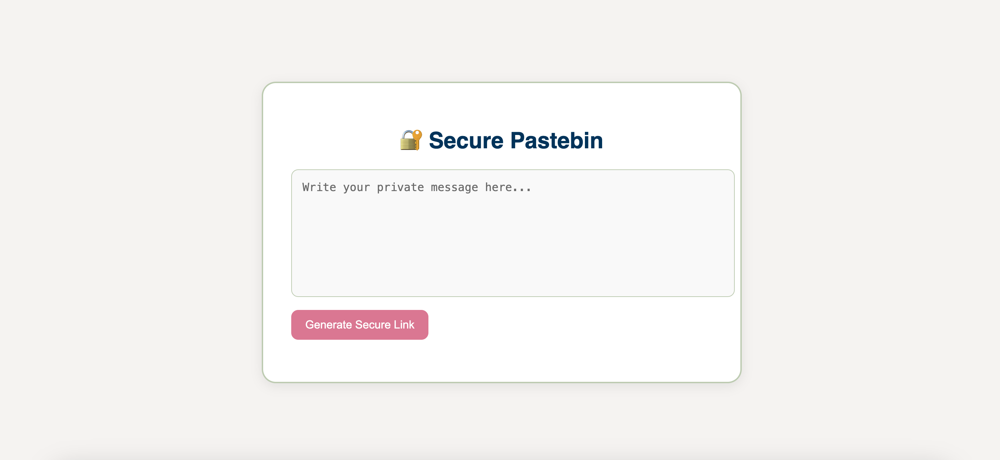
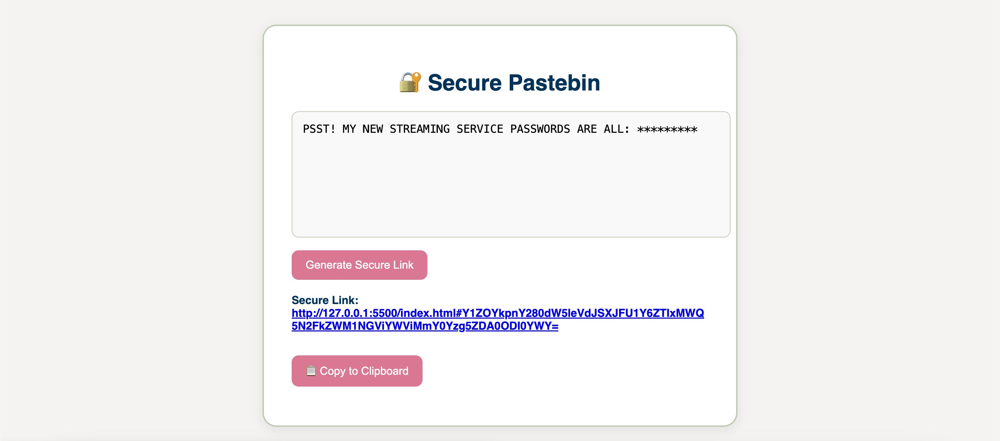

# 🔐 Secure Pastebin — End-to-End Encrypted Message Sharing

This is a lightweight web app that allows users to send private, encrypted messages through a single-use link. The message is **encrypted in your browser**, saved to a temporary database, and **deleted automatically after the recipient views it.**

## ✨ Features

- AES-256 encryption (client-side using CryptoJS)
- Messages auto-delete after a single view
- Zero knowledge — we can’t read your message!
- Uses Firebase Firestore (no server required)
- Copy-to-clipboard functionality
- Clean, responsive UI

## 🚀 How It Works

1. Type your message.
2. Click **"Generate Secure Link"**.
3. A one-time-use link is created.
4. Share the link — once opened, the message is revealed and permanently deleted from the database.

## 🛠 Tech Stack

- HTML, CSS, JavaScript
- [CryptoJS](https://cryptojs.gitbook.io/docs/) for encryption
- [Firebase Firestore](https://firebase.google.com/products/firestore) for secure data storage
- Firebase SDK for database interaction

## 🧪 Try It Live

🌐 [Live Site](https://your-live-link.netlify.app) — _(replace with your deployed link)_

## 📸 Screenshots

|  |  |

## 🤝 Credits

Created by [Gianna Martinez](https://github.com/giannamartinez-acct) as a cybersecurity portfolio project.

